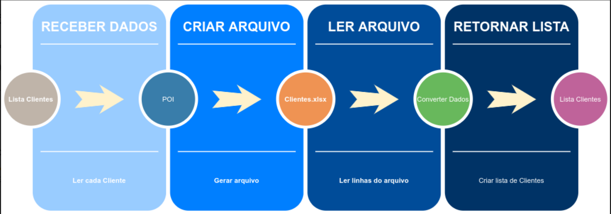

# Feltex-excel-util

  Aprenda como trabalhar com arquivos MS Excel utilizando o framework Apache POI.

## Como funciona no projeto

## Tecnologias

- [Instalando o Java 11](https://youtu.be/_NCt_82M0MA)
- [Instalação do Maven](https://youtu.be/edF1G8RYDTU)
- [Criando testes com Junit](https://youtu.be/Stzdft52bIA)
- [Como usar o Lombok](https://youtu.be/ypITltqNE9g)
- [Configurando o Log com Logback](https://youtu.be/52iaLpBkYC0)
- [Apache POI](https://poi.apache.org/)

## 📺 Link dos vídeos

 - [Arquivos Excel](https://www.youtube.com/watch?v=KLeDQtiShsA)
